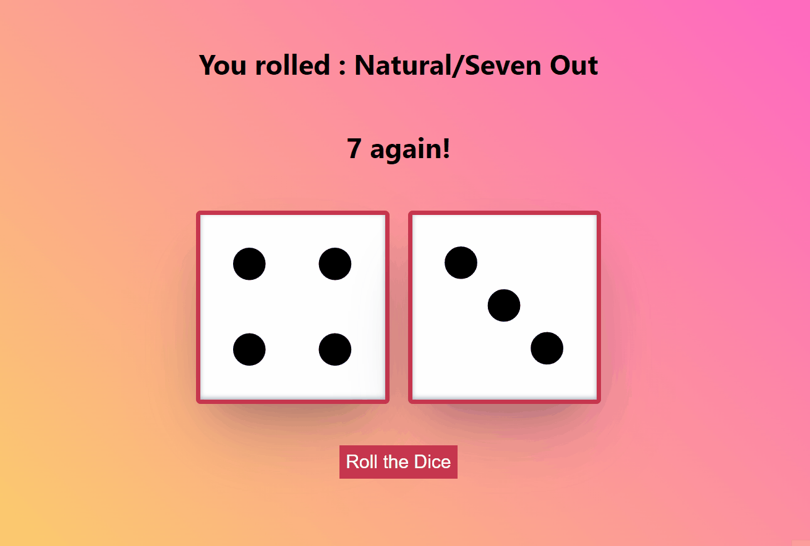

## Craps

Craps is a dice game in which players bet on the outcomes of a pair of dice. Players can wager money against each other (playing "street craps") or against a bank ("casino craps"). Because it requires little equipment, "street craps" can be played in informal settings. While shooting craps, players may use slang terminology to place bets and actions.

